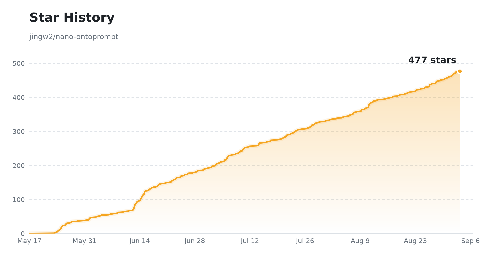

# nano-ontoprompt

**[English Documentation](./README.md)**

一个轻量级、借鉴 Palantir Foundry 设计的领域本体构建平台。接入数据源,经过可视化转换管道处理,将清洗后的数据集映射为实体类型,最终生成可探索的知识图谱——包含实体、关系、逻辑规则与可执行动作。

支持两条构建路径:

- **Pipeline Mapping**(v2)— 完整数据集成链路:`数据接入 → 原始存储 → 转换 → Curated 数据集 → 本体映射`
- **简易 LLM 提取**(v1)— 上传文档,选择提示词和模型,一键提取知识图谱

---

## 什么是本体(Ontology)?

本体是特定领域知识的形式化表示——一套共享的概念词汇及概念间的关系。它是把原始数据变成机器可读、可查询知识的结构化骨架。

在 nano-ontoprompt 中,每个本体由以下构件组成:

| 构件 | 含义 | 示例 |
|---|---|---|
| **实体(Object Type)** | 从 Curated 数据集映射出的核心概念,每行数据一个节点 | `Supplier`、`PurchaseOrder` |
| **关系(Link Type)** | 实体间的边,由外键检测与跨数据集值重叠推断 | `PurchaseOrder -[HAS_SUPPLIER]-> Supplier` |
| **逻辑规则(Logic)** | 规则层:从 schema 约束、质量报告、状态字段和图关系中发现的映射/校验/状态/推断/自动化规则 | `amount > 0`、`库存状态` 状态机 |
| **动作(Action)** | 可执行行为层:基于实体类型与关系生成的 CRUD、状态流转、链接维护动作,含提交校验与审计快照 | `Approve Record`、`Link Order to Supplier` |

**典型场景:** 供应链知识建模、医疗概念提取、金融合规规则、法律文档结构化——任何需要把异构数据转化为结构化知识的领域。

---

## 功能特性

### 数据管道(v2)
- **可视化管道构建器** — 画布上编排连接器/存储器/转换器/输出节点,逐节点状态与数据预览
- **三条转换路径** — A:结构化(CSV/Excel,schema 推断 + 清洗);B:半结构化(JSON 拍平 / XML 解析);C:非结构化(文档 → Markdown → LLM 或规则结构化提取)
- **连接器** — 文件上传、MySQL/PostgreSQL、MongoDB、REST API(支持增量同步)
- **Curated 数据集** — 质量评分、人工审核(仅管理员可审批)、版本管理

### 本体(v2)
- **自动映射引擎** — 数据集→实体类型、列→属性、外键→关系类型,自动推断基数
- **跨数据集关系推断** — 精确外键匹配、值格式容错(`SUP-001` ↔ `SUP001`)、备用键匹配(如文档中提到的公司名直接连到 Supplier 实体)、可选 LLM 辅助语义链接(`ENABLE_LLM_FK_DETECTION=1`)
- **Logic & Actions 发现机制** — 规则与动作从映射、schema 约束、状态字段和关系中自动发现,经 草稿 → 审核 → 发布 流程上线
- **知识图谱** — Cytoscape.js 交互式网状视图,可一键隐藏孤立节点;Neo4j 可用时由其驱动,否则回退 SQLite
- **搜索** — 关键词搜索(ChromaDB 不可用时回退 SQL)与语义搜索(ChromaDB)

### 质量审查(ReAct Agent)
- **LLM 驱动多步审查** — AI Agent 系统检查本体质量:孤立实体、断链引用、缺失关系、低覆盖实体类型
- **工具调用架构** — 8 个内置检查工具(摘要、覆盖率、引用校验、模式推断)可链式调用
- **审查报告** — 按严重级别分类的问题及修复建议,持久化为审计任务

### 平台
- **LLM 提取** — 支持 OpenAI、Anthropic 及任何 OpenAI 兼容模型;多道防线杜绝模糊关系类型
- **LiteLLM 代理** — 可选 LiteLLM 集成,统一管理多 LLM 提供商的 API Key 与用量
- **提示词管理** — 领域提示词版本化管理,一键生成模板
- **数据管理** — 结构化数据浏览器,含 Curated 数据集详情面板、行级编辑与审核流程
- **导出** — JSON、YAML、CSV、Turtle (RDF)、HTML
- **优雅降级** — Neo4j / MinIO / ChromaDB / Redis 全部可选;缺失时自动回退 SQLite + 本地文件存储 + 同步执行
- **多语言界面** — 中英文切换
- **用户管理** — JWT 认证,admin/editor 角色;Curated 审批仅限管理员

---

## 技术栈

| 层 | 技术 |
|---|---|
| 前端 | React 18、TypeScript、Vite、Tailwind CSS、Cytoscape.js |
| 后端 | FastAPI、SQLAlchemy、Alembic |
| 元数据库 | SQLite(开发)/ PostgreSQL(生产) |
| 对象存储 | MinIO(可选,本地文件回退) |
| 图数据库 | Neo4j(可选,SQLite 回退) |
| 向量库 | ChromaDB(可选) |
| 任务队列 | Celery + Redis(可选,同步执行回退) |
| LLM 客户端 | OpenAI SDK、Anthropic SDK |
| LLM 代理 | LiteLLM(可选) |

---

## 架构指南

深入理解 Ontology-as-a-Service 架构设计 — 包括 Object/Link/Function/Governance 设计模式、多租户隔离、临床筛查工作流、生产部署 Checklist — 详见 **[ONTOLOGY.md](./ONTOLOGY.md)**（2727 行）。

---

## 快速开始

### 方式一 — Docker Compose(完整 v2 栈)

```bash
git clone https://github.com/jingw2/nano-ontoprompt.git
cd nano-ontoprompt
cp .env.example .env          # 生产环境务必修改密钥
docker compose -f docker-compose.v2.yml up --build
```

将启动 PostgreSQL、Redis、Neo4j、MinIO、ChromaDB、后端与前端。轻量 v1 栈可改用 `docker-compose.yml`。

打开 [http://localhost:5173](http://localhost:5173),默认账号 `admin / admin123`。

### 方式二 — 手动启动(最小化,无需外部服务)

**前置要求:** Python 3.11+、Node.js 18+

```bash
# 后端
cd backend
python -m venv .venv && source .venv/bin/activate   # Windows: .venv\Scripts\activate
pip install -r requirements.txt
alembic upgrade head                                  # 开发模式也可依赖启动时自动建表
uvicorn app.main:app --reload --port 8000

# 前端(另开终端)
cd frontend
npm install
npm run dev
```

Neo4j / MinIO / ChromaDB / Redis 均为可选——缺失时系统自动使用 SQLite 图谱回退、本地文件存储与同步管道执行。

---

## 使用流程(Pipeline Mapping 路径)

1. **配置模型** — *模型 → 添加模型*:填写提供商、API Key、Base URL,并标记用途(提取 / VLM / FK 检测)。
2. **创建管道** — *数据管道 → 新建*:在画布上编排 连接器/存储器/转换器/输出 节点,挂载数据文件,选择转换路径,点击**运行**。
3. **审核数据** — *数据管道 → Curated*:查看质量评分与预览,管理员审批通过。
4. **创建本体** — *本体 → 新建*,构建方式选 **Pipeline Mapping**:选择已审批的 Curated 数据集,逐个映射为实体类型并指定主键。
5. **构建** — 系统自动推断跨数据集关系,并发现 Logic 规则与 Actions 草稿。
6. **探索** — *知识图谱* 标签页查看网状结构;*实体 / 逻辑规则 / 动作* 标签页查看详情、完成审核并发布。
7. **导出** — 在 *基本信息* 标签页导出 JSON、YAML、CSV、Turtle (RDF) 或 HTML。

**简易 LLM 提取**路径:新建本体时选 `simple_llm` 模式,在 *文件* 标签页上传文档,选择提示词与模型后运行提取。

---

## 项目结构

```
nano-ontoprompt/
├── backend/
│   ├── alembic/               # 数据库迁移 (0001_full_baseline 覆盖全部表)
│   ├── app/
│   │   ├── routers/           # v1 + v2 REST API 端点
│   │   ├── models/            # SQLAlchemy ORM 模型 (v1 + v2)
│   │   ├── services/
│   │   │   ├── connection/    # 文件 / SQL / Mongo / REST 连接器
│   │   │   └── v2/
│   │   │       ├── pipeline/  # 转换引擎、A/B/C 三路径、处理步骤
│   │   │       ├── mapping/   # 自动映射、外键与备用键关系推断
│   │   │       ├── graph/     # Neo4j 服务、Cypher 校验、图分析
│   │   │       ├── curated/   # 质量评分、审核流程
│   │   │       └── vector/    # ChromaDB 服务
│   │   └── tasks/             # Celery 任务 (管道运行、同步、提取)
│   ├── scripts/               # 维护脚本 (孤儿数据清理、迁移)
│   └── tests/                 # 300+ pytest 用例
├── frontend/
│   ├── scripts/                # 一次性调试/演示/测试脚本
│   └── src/
│       ├── pages/pipelines/    # 管道列表 + 画布构建器
│       ├── pages/ontologies/   # 本体详情: 图谱 / 实体 / 逻辑 / 动作 / 审查
│       ├── pages/data-management/  # 结构化数据浏览器 + Curated 详情面板
│       └── api/                # Axios 客户端 (v1 + v2)
├── scripts/
│   └── data/                   # 数据导入与实体关联脚本 (SNOMED、供应链)
├── docker-compose.yml          # v1 轻量栈
├── docker-compose.v2.yml       # 完整栈: Postgres + Redis + Neo4j + MinIO + Chroma + LiteLLM
├── litellm_config.yaml         # LiteLLM 代理配置
├── ONTOLOGY.md                 # 架构设计指南
└── test_data/                  # 示例数据集与 E2E 验收脚本
```

---

## 环境变量

完整列表见 `.env.example`,核心配置:

```env
ENVIRONMENT=development        # 设为 production 时, 默认密钥未修改将拒绝启动
DATABASE_URL=sqlite:///./ontoprompt.db
SECRET_KEY=change-me
ENCRYPTION_KEY=                # Fernet 密钥, 用于加密存储的 API Key
FIRST_ADMIN_USER=admin
FIRST_ADMIN_PASSWORD=admin123

# 可选服务 (缺失时优雅降级)
REDIS_URL=redis://localhost:6379/0
NEO4J_URI=bolt://localhost:7687
MINIO_ENDPOINT=localhost:9000
CHROMA_HOST=localhost

# 上传限制
MAX_UPLOAD_MB=200
ALLOWED_UPLOAD_EXTENSIONS=csv,xlsx,xls,json,xml,pdf,docx,doc,pptx,ppt,md,txt

# 可选: LLM 辅助语义外键检测 (需先配置模型)
ENABLE_LLM_FK_DETECTION=0
```

---

## 故障排查

**前端容器报 `AggregateError [ECONNREFUSED]`,登录失败。**
拉取最新代码 — Vite 代理已通过 `VITE_API_PROXY_TARGET` 在 Docker 内指向 `http://backend:8000`。然后重建: `docker compose up -d --build frontend`。

**已有部署用 `admin / admin123` 登录失败。**
admin 用户用旧的默认密码 seed,需要重置:

```bash
# Docker
docker compose exec backend python scripts/reset_admin_password.py

# 手动启动
cd backend && python scripts/reset_admin_password.py
```

可选参数: `--user <username>` (默认 `admin`)、`--password <new_pwd>` (默认 `admin123`)。

**LLM 提取被 OOM-kill(macOS 或低内存环境)。**
并行 LLM 提取在内存有限的机器上可能耗尽资源。代码已默认改为串行提取(`max_workers=1`)。如仍遇到问题,可逐域提取,或减少每次提取上传的文件数。

---

## Star History

<picture>
  <source media="(prefers-color-scheme: dark)" srcset="assets/star-history-dark.png" />
  <source media="(prefers-color-scheme: light)" srcset="assets/star-history-light.png" />
  
</picture>

<sub>由 [`scripts/gen_star_history.py`](scripts/gen_star_history.py) 生成，[GitHub Actions](.github/workflows/star-history.yml) 每日自动更新</sub>

---

## 许可证

MIT
